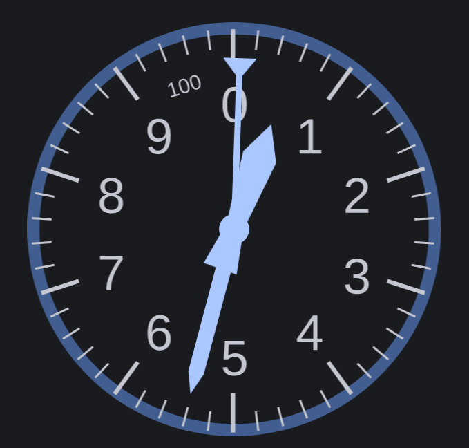

# Altimeter 

A simple altimeter view. The drawables can be changed with
your own custom assets.



Taken from com.leondzn.simpleanalogclock
https://github.com/leondzn/simple-analog-clock

## Prerequisites

Your project must be using AndroidX artifacts instead of Support Libraries. 
Otherwise your project build will fail due to `Manifest merger failed` error.

## Installation

```gradle
allprojects {
  repositories {
    ...
    maven { url 'https://jitpack.io' }
  }
}
```

```gradle
dependencies {
  implementation 'com.github.woheller69:AltimeterView:-SNAPSHOT'
}
```


## Usage

### XML
```xml
<org.woheller69.altimeterview.AltimeterView
    android:id="@+id/altimeter"
    android:layout_width="match_parent"
    android:layout_height="match_parent"
    android:layout_margin="16dp"
    app:hand10kTint="@color/colorPrimary"                                        
    app:hand100Tint="@color/colorAccent" />
```

**The following XML attributes are supported:**

`app:backTint, app:numbersTint, app:ticksTint, app:hand10kTint, app:hand1kTint, app:hand100Tint`

to colorize the altimeters's elements.

You can manually set the individual hands' rotation value given a specific angle using

`app:hand10kRotation, app:hand1kRotation, app:hand100Rotation`

You can also provide custom drawables for the altimeter using

`app:backDrawable, app:numbersDrawable, app:ticksDrawable, app:hand10kDrawable, app:hand1kDrawable, app:hand100Drawable`

More info on providing custom drawables are detailed below.

### Java

```java
AltimeterView altimeter = findViewById(...);

altimeter.setHand1kTint(...)
  .setAltitude(altitude);
```

You can rotate the clock hands individually using the following methods:

`setHand10kRotation(angle), setHand1kRotation(angle), setHand100Rotation(angle)`

Using the methods above requires you to calculate the corresponding angles for each value.

To use exact altitude values, use the following methods:

`setAltitude(double altitude)`

Similar to the XML attributes, you can also provide custom drawables to use with the altimeter:

`setBackDrawable(Drawable), setNumbersDrawable(Drawable), setTicksDrawable(Drawable), setHand10kDrawable(Drawable), setHand1kDrawable(Drawable), setHand100Drawable(Drawable)`

## Using Custom Drawables

Default drawables are provided but you are free to use custom drawables
provided that they follow these guidelines:

* All 6 layers (back, ticks, numbers, 10k-hand, 1k-hand, 100-hand) should all be the same image size
* The images should be square
* Clock hands should be pointing at the 0 position
* SVG or PNG can be used

